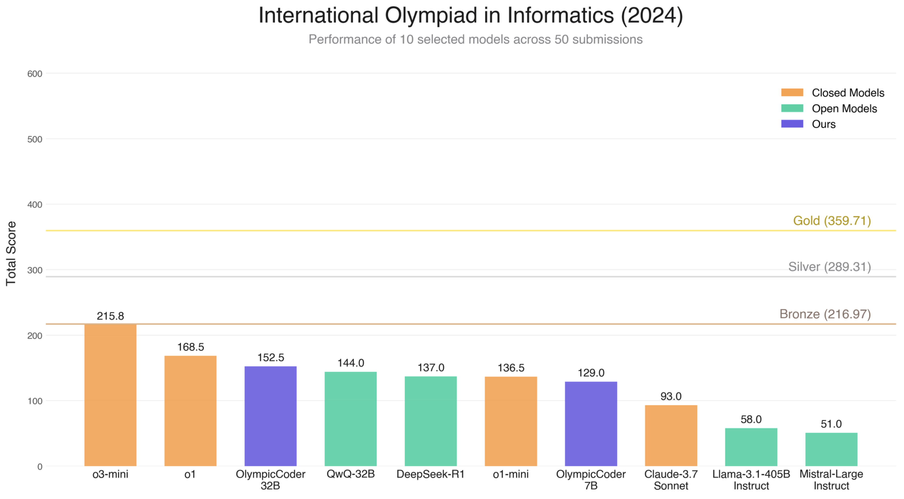

# IOI

## Dataset links
- [Problem statements dataset](https://huggingface.co/datasets/open-r1/ioi) (IOI’2020 - IOI’2024): `open-r1/ioi`
- [Test cases](https://huggingface.co/datasets/open-r1/ioi-test-cases): `open-r1/ioi-test-cases`
- [Official (ground truth) solutions](https://huggingface.co/datasets/open-r1/ioi-sample-solutions): `open-r1/ioi-sample-solutions`
- [Evaluation data for 40+ leading models on IOI’2024](https://huggingface.co/datasets/open-r1/ioi-2024-model-solutions): `open-r1/ioi-2024-model-solutions`

## Generating solutions
To have models generate solutions to IOI problems, follow the instructions in the [generate](generate/README.md) directory.

## Running tests
To run tests on generated solutions, follow the instructions in the [run_tests](run_tests/README.md) directory.
